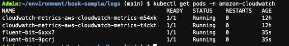
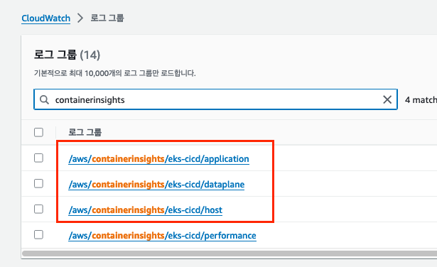

# Fluent Bit을 데몬셋으로 설정하여 CloudWatch Log fh로 전송

### Fluent Bit 설정
1. amazon-cloudwatch라는 네임스페이스가 아직 없는 경우 다음 명령을 입력하여 네임스페이스를 생성

    ```bash
    kubectl apply -f https://raw.githubusercontent.com/aws-samples/amazon-cloudwatch-container-insights/latest/k8s-deployment-manifest-templates/deployment-mode/daemonset/container-insights-monitoring/cloudwatch-namespace.yaml
    ```

2. 로그 전송을 위한 클러스터 이름, 리전 정보를 포함하는 ConfigMap생성

    ```bash
    ClusterName=$CLUSTER_NAME
    RegionName=$AWS_REGION
    FluentBitHttpPort='2020'
    FluentBitReadFromHead='Off'
    [[ ${FluentBitReadFromHead} = 'On' ]] && FluentBitReadFromTail='Off'|| FluentBitReadFromTail='On'
    [[ -z ${FluentBitHttpPort} ]] && FluentBitHttpServer='Off' || FluentBitHttpServer='On'
    kubectl create configmap fluent-bit-cluster-info \
    --from-literal=cluster.name=${ClusterName} \
    --from-literal=http.server=${FluentBitHttpServer} \
    --from-literal=http.port=${FluentBitHttpPort} \
    --from-literal=read.head=${FluentBitReadFromHead} \
    --from-literal=read.tail=${FluentBitReadFromTail} \
    --from-literal=logs.region=${RegionName} -n amazon-cloudwatch
    ```


3. Fluent Bit 설정파일 다운로드
    ```bash
    wget https://raw.githubusercontent.com/aws-samples/amazon-cloudwatch-container-insights/latest/k8s-deployment-manifest-templates/deployment-mode/daemonset/container-insights-monitoring/fluent-bit/fluent-bit.yaml
    ```

4. Fluent Bit 데몬 셋 설치

    ```bash
    kubectl apply -f fluent-bit.yaml
    ```

5. fluent-bit* 이라는 pod가 생성된 것 확인
    ```bash
    kubectl get pods -n amazon-cloudwatch
    ```
    

6. CloudWatch 콘솔로 이동하여 로그 그룹을 선택하여 배포한 로그그룹 확인 

    ```bash
    kubectl get pods -n amazon-cloudwatch
    ```
    


